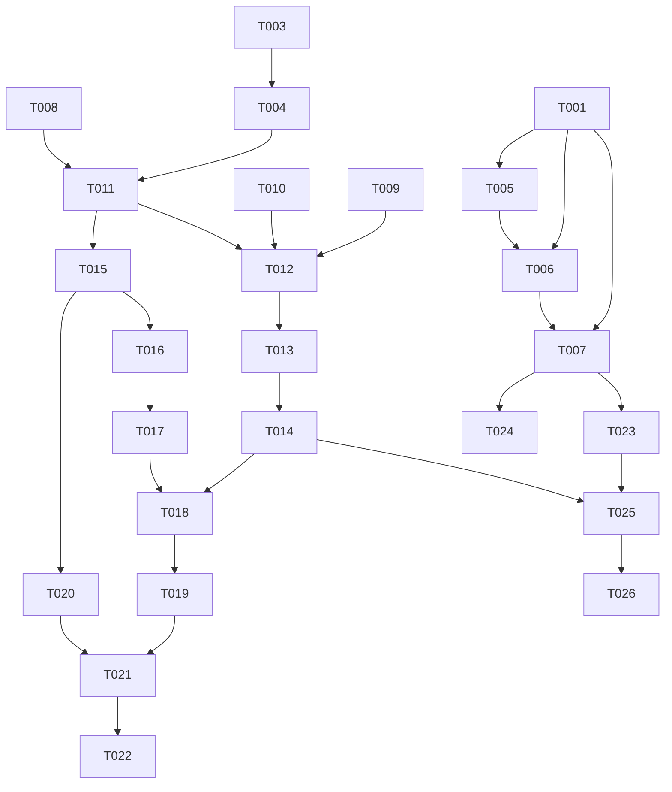

# Tasks: 用户注册与登录

**Feature**: spec/user-auth  
**Generated**: 2026-07-03

## Phase 1: Setup

- [X] T001 添加 Spring Security 和 JJWT 依赖到 pom.xml
- [X] T002 在 frontend/package.json 中确认无新依赖需添加（已有 axios/vue-router/antd）

## Phase 2: Foundational

- [X] T003 创建 User 实体 (id, username, password, createdAt) 在 src/main/java/com/keycard/entity/User.java
- [X] T004 创建 UserRepository (findByUsername, count) 在 src/main/java/com/keycard/repository/UserRepository.java
- [X] T005 创建 JwtUtil 工具类 (生成/验证/解析 JWT) 在 src/main/java/com/keycard/config/JwtUtil.java
- [X] T006 创建 JWT 认证过滤器 JwtFilter 在 src/main/java/com/keycard/config/JwtFilter.java
- [X] T007 创建 SecurityConfig (放行 /api/auth/**, 拦截其他, 注册 JwtFilter) 在 src/main/java/com/keycard/config/SecurityConfig.java
- [X] T008 [P] 创建 LoginRequest DTO 在 src/main/java/com/keycard/dto/LoginRequest.java
- [X] T009 [P] 创建 RegisterRequest DTO 在 src/main/java/com/keycard/dto/RegisterRequest.java
- [X] T010 [P] 创建 AuthResponse DTO 在 src/main/java/com/keycard/dto/AuthResponse.java

## Phase 3: User Story 1 - 管理员注册 (P1)

- [X] T011 [US1] 实现 AuthService.register (检查无用户→BCrypt加密→保存→返回JWT) 在 src/main/java/com/keycard/service/AuthService.java
- [X] T012 [US1] 实现 AuthController (/api/auth/register, /api/auth/check) 在 src/main/java/com/keycard/controller/AuthController.java
- [X] T013 [US1] 创建注册页面 Register.vue 在 frontend/src/views/Register.vue
- [X] T014 [US1] 修改路由：添加 /register 路由，添加导航守卫（无用户→注册页）在 frontend/src/router/index.js

## Phase 4: User Story 2 - 管理员登录 (P1)

- [X] T015 [US2] 实现 AuthService.login (验证用户名密码→返回JWT) 在 src/main/java/com/keycard/service/AuthService.java
- [X] T016 [US2] 实现 AuthController (/api/auth/login) 在 src/main/java/com/keycard/controller/AuthController.java
- [X] T017 [US2] 创建登录页面 Login.vue 在 frontend/src/views/Login.vue
- [X] T018 [US2] 修改路由：添加 /login 路由，完善导航守卫（未登录→登录页, 已登录→主页）在 frontend/src/router/index.js
- [X] T019 [US2] 修改 Axios：添加请求拦截器(Authorization头)和响应拦截器(401→登录页) 在 frontend/src/api/index.js

## Phase 5: User Story 3 - 管理员退出登录 (P2)

- [X] T020 [US3] 实现 AuthController (/api/auth/logout) 在 src/main/java/com/keycard/controller/AuthController.java
- [X] T021 [US3] 修改 App.vue：添加退出按钮，点击清除 localStorage token 并跳转登录页 在 frontend/src/App.vue
- [X] T022 [US3] 修改 App.vue：未登录时隐藏左侧菜单 在 frontend/src/App.vue

## Phase 6: Polish

- [X] T023 修改 GlobalExceptionHandler 处理认证相关异常 在 src/main/java/com/keycard/exception/GlobalExceptionHandler.java
- [X] T024 清理 WebConfig 中 CORS 配置（Spring Security 已接管 CORS） 在 src/main/java/com/keycard/config/WebConfig.java

## Phase 7: Verification

<!-- verification_scope: build-only -->

- [X] T025 编译后端项目并修复任何编译错误
- [X] T026 构建前端项目并修复任何构建错误

## 📊 Dependency Graph

## ⚡ Parallel Execution Guide

| Phase | Tasks | Required Files | Execution Notes |
|-------|-------|----------------|-----------------|
| Foundational | T008, T009, T010 | dto/LoginRequest, dto/RegisterRequest, dto/AuthResponse | 三个 DTO 无相互依赖，可并行 |
| Stories | T011 + T015 | service/AuthService | 同一文件，需顺序完成注册和登录逻辑 |
| Stories | T013, T017 | views/Register.vue, views/Login.vue | 页面独立，可并行 |

**Summary**: 26 tasks | US1: 4 tasks | US2: 5 tasks | US3: 3 tasks | Setup: 2 | Foundational: 8 | Polish: 2 | Verification: 2
